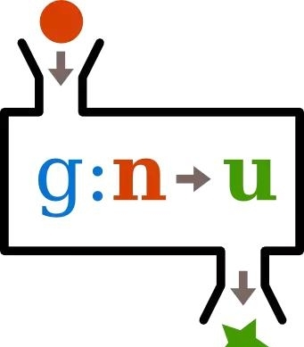
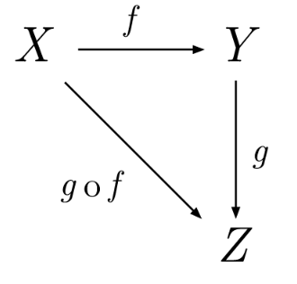

## 函数式编程（Functional Programming）
函数式编程的起源，是一门叫做[范畴论,category theory]()的数学分支。在计算机科学中，函数式编程是一种编程范式(programming paradigm,构建计算机程序和结构的方法和风格)，将计算视为数学函数的求值过程并避免改变状态和可变的数据，即使用函数来抽象作用在数据之上的控制流和操作，消除副作用并减少状态改变。

<!--more-->
### 范畴论


### 纯函数（Pure Function）
`函数`是不同数值之间的特殊关系，每个输入值返回且只有一个输出值，即函数表示数值间的关系。


不是函数关系，输入值5指向了多个输出：


`纯函数`也称为函数的纯粹性（Purity），指没有副作用的函数，对于相同的输入，永远返回相同的结果。
函数式编程分为纯函数式和函数式，纯函数式主要在于确保函数遵循函数式范式，只依赖实际参数，而不受全局或局部状态的影响。纯函数式的好处就是更容易的实现惰性求值，简化了并行计算。


函数与纯函数：
```
var xs = [1,2,3,4,5];

// 纯的
xs.slice(0,3);
//=> [1,2,3]

xs.slice(0,3);
//=> [1,2,3]

xs.slice(0,3);
//=> [1,2,3]


// 不纯的
xs.splice(0,3);
//=> [1,2,3]

xs.splice(0,3);
//=> [4,5]

xs.splice(0,3);
//=> []


// 不纯的
var minimum = 21;

var checkAge = function(age) {
  return age >= minimum;
};

// 纯的
var checkAge = function(age) {
  var minimum = 21;
  return age >= minimum;
};
```
`slice`和`splice`函数都是对数组进行切片，但是`slice`函数对相同的参数总是返回相同的结果；而`splice`函数因为在原数组上进行操作，却得到了不同的结果，产生了副作用。  
`checkAge`函数的结果都取决于`minimum`这个变量值，但第一个`checkAge`函数使用了外部变量，即引入了外部状态，函数的结果受外部状态的影响；而第二个`chengAge`函数的结果不受状态的影响。

1. 副作用(Side Effects)：副作用指的是状态的变化（state mutation），在计算过程中，函数内部与外部交互，产生其他结果。
2. 引用透明(Referential Transparency)：函数的执行不依赖外部状态，只依赖于输入的参数，对于相同的输入，总是得到相同的输出。
3. 不变性(Immutability)：为了得到引用透明性，任何值都是不可变的。

### 函数式编程的特点

1. 函数是一等公民(First-class Function)：函数与其他数据类型一样，可以作为变量，也可作为参数传入到另一函数中，或者作为其他函数的返回值。
```
var print = function(i) { console.log(i); };
[1,2,3].forEach(print);

// 函数作为参数示例
const getServerStuff = callback => ajaxCall(json => callback(json));
const getServerStuff = ajaxCall;
```
函数作为参数，能够减少代码量，降低代码维护成本以及提高重用性。

2. 使用expression而不是statement  
表达式(expression)是一个单纯的运算过程，总是有返回值；语句(statement)是某种操作，没有返回值。函数式编程中只有expression，变量、函数都是expression。  
函数式编程一切都是为了处理运算(computation)，而不考虑系统的IO，statement属于系统的IO操作，所以排斥在外，将IO限制到最小，减少不必要的IO，保持计算的纯粹性。

3. 高阶函数(Higher order Function)：接受其他函数作为入参的一种函数，达到更高程度的抽象。
```
def add(x: Int, y: Int, f: Int => Int) = f(x) + f(y)
println(add(-5,6,Math.abs))
```

4. 闭包(closure)：对外部作用域的变量进行引用的内部函数就称为闭包。函数的内部调用数据对于使用者来说是不透明的，引用的外部变量是动态，可以通过改变其值进而改变函数的运行效果。
```
var factor = 3
def multiplier(x):
  return factor * x

print multiplier(2)
```

5. 柯里化(curry)：将接收多个参数的函数变换成一个单一参数(函数的最初参数)的函数，并且返回的新函数能够接受余下参数且返回结果。概念是只传递函数的一部分参数来调用(局部调用)，让其返回函数处理余下的参数。
```
def pow(x):
  def pw(y):
    return math.pow(y,x)
  return pw

// 10 ^ 2
pow2 = pow(2)
print(pow2(10))
```
通过柯里化实现非常灵活的功能，如果需要计算3次方或n次方，只需要修改pow传入参数即可，通过修改传入参数的方式改变代码逻辑。

6. 组合函数(compose)：将简单函数组合成更复杂函数的行为或机制，像数学中的函数组成一样，每个函数的结果作为下一个函数的参数传递，而最后一个函数的结果是整个函数的结果。
```
// 两个简单函数
def add10(x:Int):Int = x + 10
def mult5(x:Int):Int = x * 5
// 先进行add10，然后在mult5
def mult5AfterAdd10(x:Int) = mult5(add10(x))
```
在数学中，`f ∘ g`是函数组合，称为"f由g组合"，或"f after g"。因此`(f ∘ g)(x)`等价于`f(g(x))`表示调用g之后调用f。



如图所示，X和Y之间的变形关系是函数f，Y和Z的变形关系是函数g，那么X和Z之间的关系就是g和f的组合函数`(g ∘ f)`。  
函数的组合还必须满足结合律：


